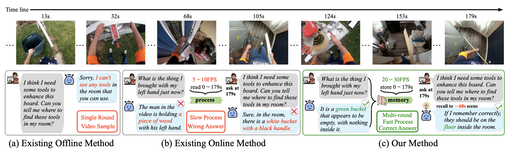

# StreamChat 
Official repo for "[Streaming Video Understanding and Multi-round Interaction with Memory-enhanced Knowledge](https://arxiv.org/abs/2501.13468)" ICLR2025🎉

## 🔥 News
**[2025.1]** 🔥 Release repo and test code.  
**[2025.2]** 🔥 Release StreamBench.

## 🚩 Approach
### Motivation


**1. Video agent with training-free and decoupled architecture.**  
**2. Multi-round interaction with memory-enhanced knowledge during inference.**  
**3. Achieving faster video processing speed.**  

### Architecture


**Selective Frame Stacking: reduce the redundant video frame feature storage.**  
**Memory Formation: update memory and retrieve the related information as in-context.**  
**Contextual Summarization: reorganize in-context as prompt for MLLM.**  

### StreamBench

StreamBench is designed for the model performance evaluation in online videos. 
It covers 4 key domains and 16 sub-class video types. 
These videos exhibit a broader distribution of length, with 6 different types that are evenly distributed. 
It consists of 6 kindsof questions (Object Search, Long-term Memory Search, Short-term Memory Search, Conversational Interaction, Knowledge-based Question Answering, and Simple Factual) to provide more comprehensive evaluation results.

## 🏃‍♂️ Getting Started
You need at least 2x80G GPU to run.  
Sorry for the terrible code, we are trying to solve it.

### Preparation
Download StreamBench.
- [StreamBench_v0.3](https://huggingface.co/datasets/Barry-12138/StreamBench_v0.3).   
```none
StreamBench_v0.3
├── Ego
│   │── all_videos
│── WebvVideo
│── Movie
│── streaming_bench_v0.3.json
```

Download LLaMA 3, LongVA and Embedding model weight.
- [LLaMA-3-8B](https://huggingface.co/meta-llama/Meta-Llama-3-8B-Instruct).   
- [LongVA-7B-DPO](https://huggingface.co/lmms-lab/LongVA-7B-DPO).   
- [mxbai-colbert-large-v1](https://huggingface.co/mixedbread-ai/mxbai-colbert-large-v1).   
- [all-MiniLM-L6-v2](https://huggingface.co/sentence-transformers/all-MiniLM-L6-v2)

### Environment
```shell
git clone https://github.com/hmxiong/StreamChat.git
cd StreamChat
pip install torch==2.3.1 torchvision==0.18.1 torchaudio==2.3.1 --index-url https://download.pytorch.org/whl/cu121
pip install -r requirements.txt
```

### Inference, scouring and get results
```shell
# change model setting
Change the 'embedding_model_dict -> minilm-l6' path in memory_bank/memory_retrieval/configs/model_config.py
Change the 'embedding_model_id' in  inference_streaming_longva_v2.py wih mxbai-colbert-large-v1 model save path.
Change the LLaMA3, LongVA model save path in inference_streamchat_v0.3.sh
All settings that need to be changed are marked with 'Your_xxxxx'.

# run script
bash inference_streamchat_v0.3.sh
```
You can change to parameters in the script and it takes about 28 hours to get results.

**TODO**:
- [X] Test code.
- [X] Data for StreaBench.
- [ ] Online Demo.
- [ ] Single GPU inference.
- [ ] Support more model.

## 🌟 Citation
If you find this work helpful for your research, please consider citing our work.  

```bibtex
@misc{xiong2025streamingvideounderstandingmultiround,
      title={Streaming Video Understanding and Multi-round Interaction with Memory-enhanced Knowledge}, 
      author={Haomiao Xiong and Zongxin Yang and Jiazuo Yu and Yunzhi Zhuge and Lu Zhang and Jiawen Zhu and Huchuan Lu},
      year={2025},
      eprint={2501.13468},
      archivePrefix={arXiv},
      primaryClass={cs.CV},
      url={https://arxiv.org/abs/2501.13468}, 
}
```
## 🤗 Acknowledgement
StreamChat is built upon the following outstanding works: [LongVA](https://github.com/EvolvingLMMs-Lab/LongVA), [LLaVA-NeXT](https://github.com/LLaVA-VL/LLaVA-NeXT), [ChatUnivi](https://github.com/PKU-YuanGroup/Chat-UniVi), [InternVL](https://github.com/OpenGVLab/InternVL), [MemoryBank](https://github.com/zhongwanjun/MemoryBank-SiliconFriend), [FreeVA](https://github.com/whwu95/FreeVA), [LLaVA-VID](https://github.com/dvlab-research/LLaMA-VID), [Flash-VStream](https://github.com/IVGSZ/Flash-VStream), [Video-online](https://github.com/showlab/videollm-online).
Thanks！